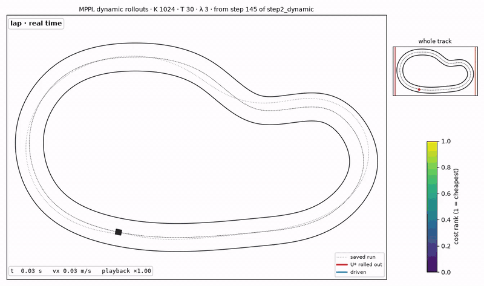

# edge-mppi

[](https://github.com/arthurfou/edge-mppi/actions/workflows/tests.yml?query=branch%3Amain)

Real-time model predictive control, GPU-accelerated, under a hard latency budget.

## What this is

An MPPI (Model Predictive Path Integral) controller for a car-like vehicle,
accelerated by a hand-written CUDA kernel and run on an NVIDIA RTX 4000 Ada
Generation (cluster GPU node) under a hard latency budget.

MPPI samples K noisy control sequences at every control step, rolls the vehicle
dynamics forward over a horizon T, scores each trajectory with a cost function,
and weights the sequences by `exp(-cost/lambda)` to produce the command that is
actually applied.

The work is in progress. The NumPy reference controller runs (kinematic, then
dynamic bicycle model with tires); the CUDA port is in progress.

<p align="center">
  
</p>

One lap of the NumPy controller with the dynamic model (step 2). At 12 m of
progress the lap slows down and zooms in on single MPPI iterations: K = 1024
noisy control sequences rolled out over T = 30 steps, colored by cost rank,
their weighted mean `U*` in red, then the first control applied and the horizon
shifted by one step. Then the lap resumes in real time.
[MP4 version](docs/media/mppi_lap.mp4), regenerated by `pixi run media`.

## Why a hand-written CUDA kernel

The rollouts are independent of each other but strictly sequential in time.
That access pattern maps badly onto cuBLAS or PyTorch, which are built around
large batched linear algebra. A fused kernel keeps the whole vehicle state in
registers for the full horizon and touches global memory only at the input and
the output, so no trajectory is ever materialized.

The state is small, 4 to 6 variables depending on the model. Thousands of
trajectories therefore fit inside a 20 ms real-time budget on a single GPU.

MPPI does not train. There is no dataset. The dynamics are written by hand and
the environment is generated by the repo itself.

## Target specifications

| Parameter | Value |
|---|---|
| Simulated platform | Ackermann vehicle, F1TENTH parameters |
| Final model | Dynamic bicycle, state `[x, y, psi, vx, vy, r]` |
| Samples K | 8192 |
| Horizon T | 50 steps |
| Timestep dt | 20 ms |
| Latency budget | < 20 ms per control iteration |
| Target GPU | NVIDIA RTX 4000 Ada Generation (AD104, compute capability 8.9, 48 SMs, 20 GB GDDR6, 130 W) |
| Execution machine | GPU node of the cluster, reached over SSH |
| Development machine | WSL2 PC without GPU (editing and compilation only) |

The 20 ms budget is the central criterion. Every optimization is measured
against it.

## Status

- [x] Step 0 - Repo foundations, CMake, shared YAML config
- [x] Step 1 - Kinematic MPPI in Python/NumPy
- [x] Step 2 - Dynamic bicycle model with tire model
- [ ] Step 3 - Naive CUDA port, validated against NumPy on fixed noise *(in progress)*
- [ ] Step 4 - Kernel optimization and Nsight profiling
- [ ] Step 5 - Real-time closed loop on the cluster GPU (separate sim and controller processes)
- [ ] Step 6 - Latency and control-quality characterization
- [ ] Step 7 - Comparison against `nav2_mppi_controller`
- [ ] Step 8 - Packaging, figures, write-up

## Architecture decisions

Four choices are fixed now because reversing them later would mean a rewrite.

**Isolated dynamics interface.** `step(state, control, dt) -> state` is a single
device function behind a clean interface. The model gets replaced three times
(kinematic, dynamic, learned). Each swap should stay mechanical.

**Parameterized state dimension.** `state_dim` is a config constant. A hardcoded
`4` anywhere means a hunt for magic numbers when the state grows to 6.

**One shared config file.** `config/mppi.yaml` holds the horizon, dt, K, lambda,
noise variances, control bounds and cost weights. The Python and the C++ paths
read the same file. Comparisons are only valid if both sides agree on every
number.

**Precomputed grid track.** The track is baked into a 2D grid (signed lateral
offset and curvilinear progress per cell) instead of a spline queried at
runtime. A CUDA kernel cannot call into SciPy, and a grid drops straight into
texture memory during the optimization step.

## Repo layout

```
python/     reference NumPy implementation, track generation, simulation loop
cuda/       CUDA kernels and the C++ control loop
config/     shared YAML configuration read by both implementations
bench/      latency sweeps and the Python/CUDA parity check
results/    generated figures, logs, recorded trajectories (gitignored)
docs/       journal and notes
docs/media/ figures and videos shown in this README (versioned, unlike results/)
```

## Getting started

```bash
curl -fsSL https://pixi.sh/install.sh | bash
pixi install
pixi run build
pixi run sim
pixi run check
```

`pixi run build` works without a GPU (only `nvcc` is needed). Running the CUDA
code, `pixi run check` and `pixi run bench` require the GPU node of the cluster.

```
pixi run sim                      # rollout model from the YAML (dynamic)
pixi run sim --model kinematic    # pixi passes the option through
pixi run sim-kin                  # shortcut for the line above
pixi run sim-both                 # dynamic then kinematic, one after the other
```

Videos, from the trajectories saved by `pixi run sim` (one or the other model):

```
pixi run video                    # saved trajectory, real time
pixi run video-mppi               # a few MPPI iterations, zoomed in, at 12 m
pixi run video-lap                # full lap, slowdown and zoom on MPPI at 12 m
pixi run media                    # regenerate docs/media/ (README video)

# every option is listed by: pixi run video-mppi --help
pixi run video-mppi \
    --start 300 \
    --steps 8 \
    --stride 3 \
    -K 512
```

Videos go to `results/videos/`. The `.mp4` output needs `ffmpeg` on the
system (a `.gif` is written otherwise); `pixi run media` needs it for the GIF.
